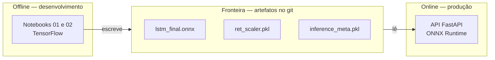
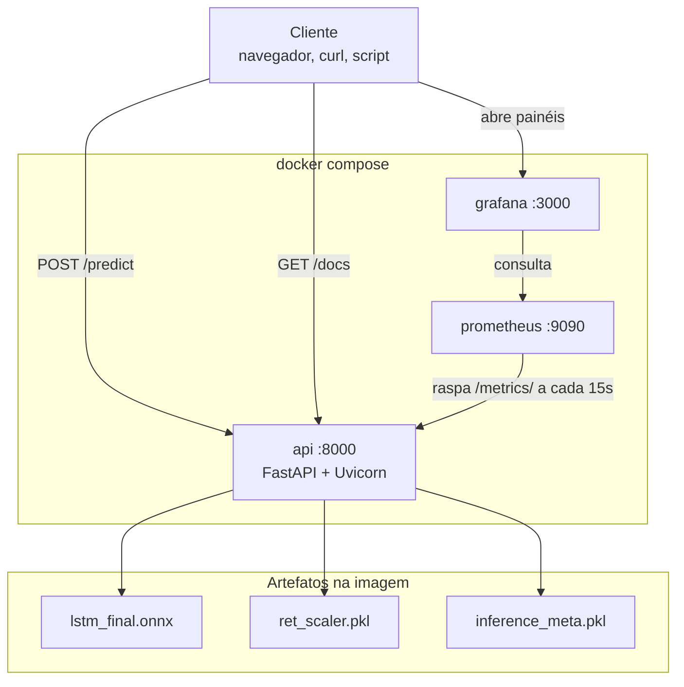
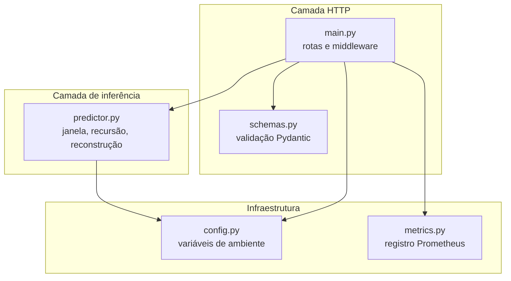
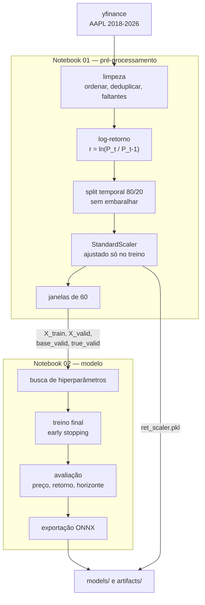
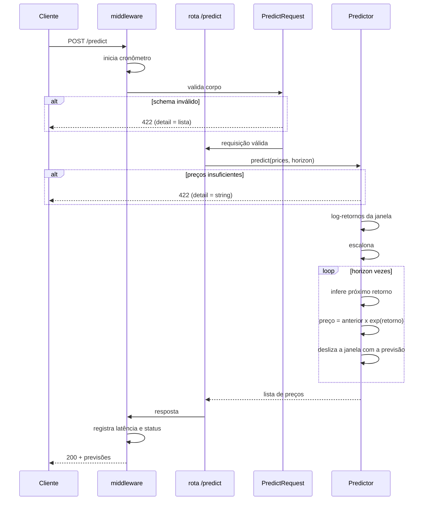
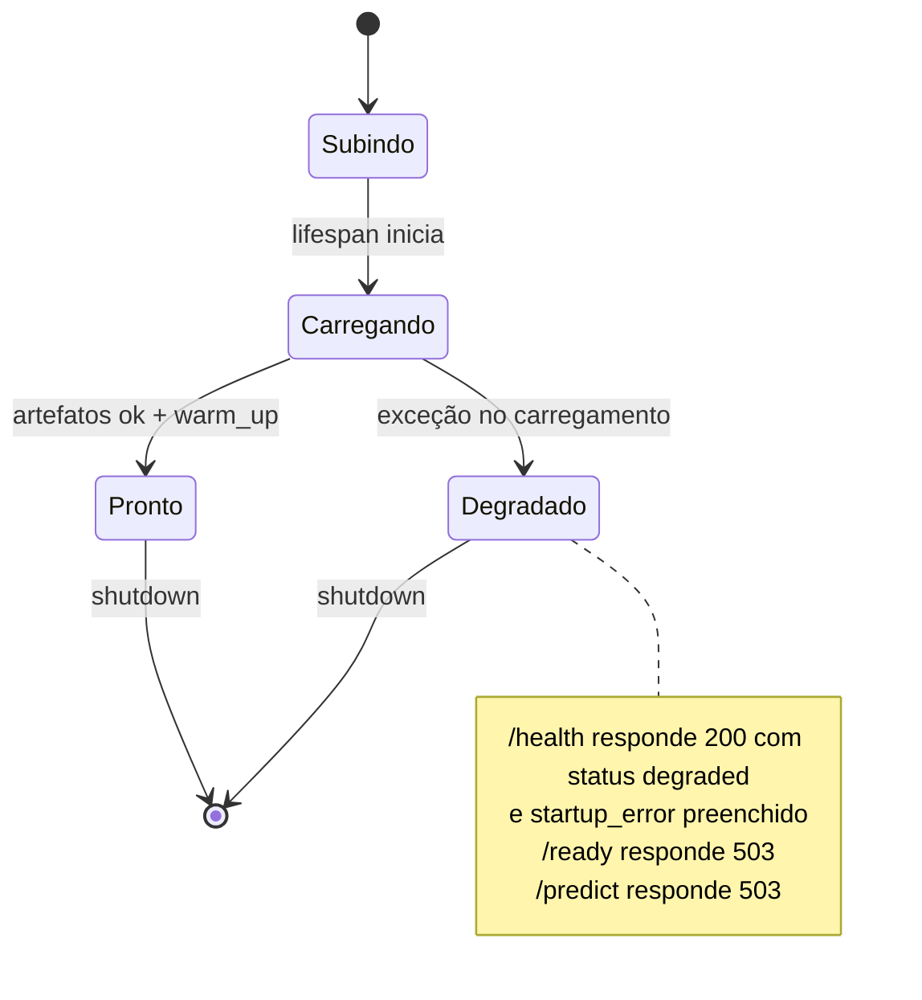
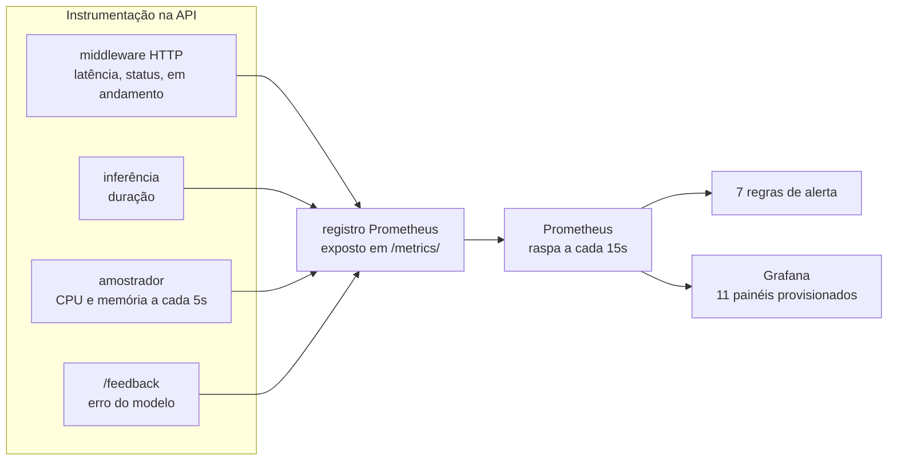
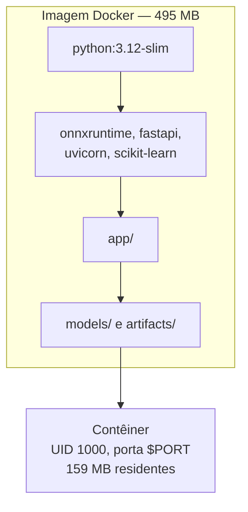
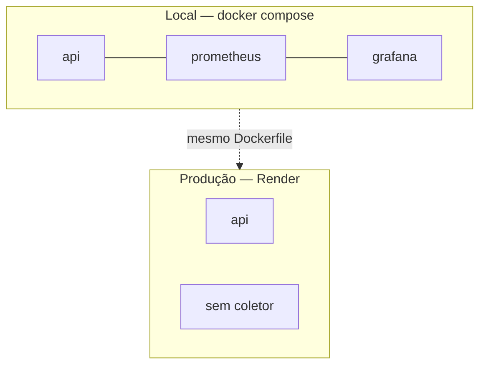

# Arquitetura

Como o projeto está organizado, o que cada peça faz e por que as
fronteiras estão onde estão. Para instruções de execução, veja o
[README](README.md).

## Princípio que organiza tudo

O projeto separa dois mundos que raramente convivem bem:

- **Offline** — os notebooks treinam e produzem artefatos. Custam
  minutos, exigem TensorFlow e rodam na máquina de quem desenvolve.
- **Online** — a API serve previsões. Custa milissegundos, não conhece
  TensorFlow e roda em contêiner.

A fronteira entre eles são os **artefatos versionados**. O offline só
escreve; o online só lê. Nada além de arquivos atravessa essa linha, e
é por isso que a imagem de produção não carrega o aparato de treino.



## Visão geral dos componentes



O Prometheus alcança a API pelo nome de serviço `api:8000`, que só
existe dentro da rede do Compose. Do navegador, o mesmo endpoint é
`localhost:8000` — a separação entre rede interna e externa é
intencional.

## Camadas da aplicação

O pacote `app/` tem 986 linhas divididas em cinco módulos, cada um com
uma responsabilidade única:

| Módulo | Linhas | Responsabilidade |
|---|---|---|
| `main.py` | 393 | rotas HTTP, ciclo de vida, middleware de métricas |
| `metrics.py` | 209 | registro Prometheus e coleta de recursos |
| `predictor.py` | 185 | carga dos artefatos e inferência recursiva |
| `schemas.py` | 161 | contratos de entrada e saída, validação |
| `config.py` | 37 | configuração por variáveis de ambiente |



A dependência é sempre de fora para dentro: o `predictor.py` não sabe
que existe HTTP, e o `schemas.py` não sabe que existe modelo. É o que
permite os testes trocarem o `Predictor` real por um falso sem tocar em
nada da camada HTTP.

## Fluxo de treino

O notebook 01 é a **única** etapa que transforma dados. O 02 apenas
consome os arrays que ele grava.



Duas fronteiras importam aqui:

**O scaler é ajustado apenas no treino.** Ajustá-lo na série inteira
vazaria a distribuição futura para dentro do conjunto de validação.

**A exportação para ONNX é parte do notebook 02**, não um passo
manual. Sem isso, retreinar deixaria a API servindo o modelo anterior
em silêncio, já que ela lê o `.onnx` e o treino escreve o `.keras`.

## Fluxo de uma previsão



O laço é o ponto central: o modelo prevê **um** passo. Horizontes
maiores realimentam a própria previsão, e por isso o erro se acumula —
comportamento medido e documentado no README.

Os dois caminhos de 422 explicam por que o campo `detail` tem formatos
diferentes: a validação de schema acontece no Pydantic, antes da rota;
a validação que depende do modelo carregado acontece dentro do
`Predictor`.

## Ciclo de vida e prontidão



A distinção entre `/health` e `/ready` é deliberada: o primeiro
sempre responde, para que a causa da falha seja legível; o segundo
recusa enquanto o modelo não estiver utilizável, para servir de
*readiness probe* a orquestradores.

O `warm_up` executa uma inferência com entrada zerada na
inicialização, para que a primeira requisição real não pague o custo
de aquecimento da sessão.

## Observabilidade



O `/feedback` é o que distingue esta stack de um monitoramento apenas
de infraestrutura: ele fecha o ciclo entre previsão e realidade,
permitindo medir o **erro do modelo em produção**, e não só o tempo de
resposta.

O amostrador de recursos roda como tarefa assíncrona dentro do ciclo
de vida da aplicação, com intervalo configurável por
`RESOURCE_SAMPLE_SECONDS`.

O caminho `/metrics` é montado como sub-aplicação, então a barra final
importa: `/metrics` redireciona, `/metrics/` responde.

## Empacotamento



Três decisões deixaram a imagem publicável em camadas gratuitas:

**ONNX no lugar do TensorFlow.** O runtime de treino pesava 1,9 GB
para executar uma rede de 66 mil parâmetros. Servir em ONNX levou a
imagem de 1,64 GB para 495 MB e a memória de 722 MB para 159 MB.

**Porta lida de `$PORT`.** As plataformas de hospedagem injetam a
porta em tempo de execução, em vez de aceitar uma fixa.

**Usuário UID 1000.** É o que essas plataformas esperam, e o `COPY`
já entrega os arquivos com o dono correto, evitando uma camada extra
de `chown` recursivo.

O `scikit-learn` permanece na imagem porque o `ret_scaler.pkl` é um
`StandardScaler` serializado — desserializá-lo exige a biblioteca.

## Topologias de execução



A mesma imagem serve aos dois cenários. A diferença é o entorno: em
nuvem sobe apenas a API, porque a plataforma executa um contêiner por
serviço e o `docker-compose.yml` não se aplica. O `/metrics/` continua
exposto, mas sem coletor — o monitoramento é demonstrado localmente.

## Contratos de dados

Os artefatos são a interface entre etapas, e cada um tem dono único:

| Artefato | Produzido por | Consumido por | Conteúdo |
|---|---|---|---|
| `AAPL_clean.csv` | notebook 01 | exemplos, testes de carga | série limpa |
| `ret_scaler.pkl` | notebook 01 | notebook 02, API | `StandardScaler` dos log-retornos |
| `inference_meta.pkl` | notebook 02 | API | símbolo, janela, alvo, reconstrução |
| `lstm_final.keras` | notebook 02 | `export_onnx.py` | modelo de origem |
| `lstm_final.onnx` | `export_onnx.py` | **API** | modelo servido |
| `metrics.pkl` | notebook 02 | documentação | avaliação e diagnósticos |

O `Predictor` valida esse contrato ao subir: se a janela declarada nos
metadados não bater com a que o grafo ONNX espera, ele recusa carregar
com uma mensagem que aponta o `export_onnx.py`. Isso impede que um
retreino parcial coloque no ar um modelo incompatível com seus
próprios metadados.

## Decisões estruturais

**Log-retorno como alvo, não preço.** O preço tem tendência: a escala
de 2018 não é a de 2026. A variação relativa é adimensional e
aproximadamente estacionária, o que torna o alvo comparável em todo o
período — e faz a API aceitar a série de qualquer ação.

**Um worker por contêiner, inferência serializada.** Cada processo
carrega uma cópia do modelo, e o cliente Python do Prometheus exige
configuração especial para métricas multiprocesso. A serialização por
`Lock` dá latência previsível; para vazão, replicam-se contêineres
atrás de um balanceador.

**Notebooks autocontidos.** Os notebooks 03 e 04 mantêm cópias
próprias do `Predictor` em vez de importar de `app/`, para que rodem
isoladamente como material didático. O custo é manter as cópias
alinhadas quando a API muda — um trabalho real, já exercido duas
vezes.

**Artefatos versionados apesar do `.gitignore`.** As pastas `models/`
e `artifacts/` são ignoradas para evitar commits acidentais de
execuções locais, mas os artefatos de inferência foram incluídos com
`git add -f`. É o que permite clonar e subir a API sem treinar nada.

## Mapa do repositório

```text
.
├── app/                    aplicação servida em produção
│   ├── config.py             variáveis de ambiente
│   ├── main.py               rotas, ciclo de vida, middleware
│   ├── metrics.py            registro Prometheus
│   ├── predictor.py          inferência recursiva
│   └── schemas.py            contratos de entrada e saída
├── notebooks/              pipeline offline
│   ├── 01_…                  coleta e pré-processamento
│   ├── 02_…                  treino, avaliação e exportação
│   ├── 03_…                  deploy da API
│   └── 04_…                  monitoramento e escalabilidade
├── models/                 modelo de origem e modelo servido
├── artifacts/              scaler, metadados, métricas e série limpa
├── monitoring/             configuração de Prometheus e Grafana
│   ├── alert_rules.yml       7 regras
│   ├── prometheus.yml        alvo de coleta
│   └── grafana/              datasource e dashboard provisionados
├── scripts/
│   ├── export_onnx.py        converte e verifica equivalência
│   ├── eval_horizon.py       erro por horizonte de previsão
│   └── load_test.py          teste de carga concorrente
├── tests/                  suíte com predictor falso
├── apresentacao/           deck e o script que o gera
├── Dockerfile              imagem da API
└── docker-compose.yml      API + Prometheus + Grafana
```
